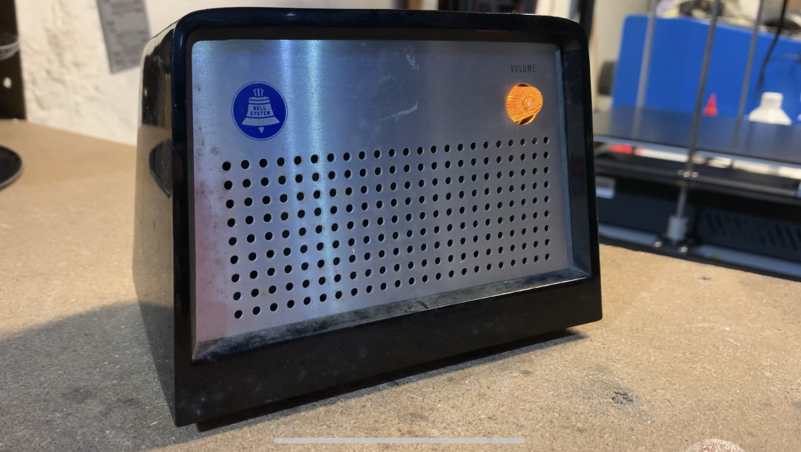
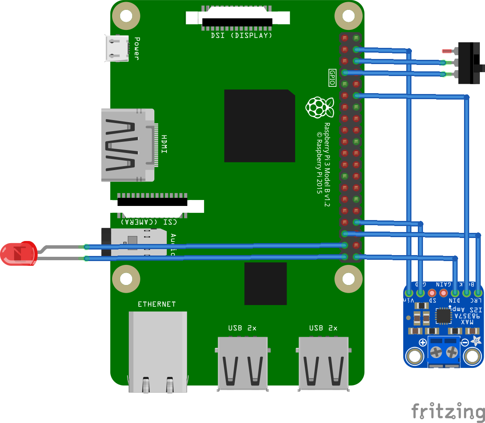

# Jarvis

An off-grid voice assistant.

Currently a work-in-progress (aren't they all?), based on the [Mycroft open voice assistant](https://mycroft.ai/) and currently crammed into a cute, old-fashione speakerphone.

As is, it is much more privacy-oriented than things like Amazon Alexa and Google...whatever they call it, but it still relies on "the cloud" for a few things.  The goal of this project is to address that to allow for completely offline use.

There are a number of projects that have laid the groundwork for this, and Mycroft themselves are working on it too, but so far I haven't found a complete "turnkey" package to do it, so I'm giving it a shot.

## TODO

* ~~Setup basic functional Mycroft installation~~
* ~~Cram this into a cool case~~
* ~~Do a better job of cramming and connect as many of the physical controls as is reasonable~~
* ~~Produce some basic documentation of what's been done so far~~
* Start reducing dependence on "the cloud"
    + STT
    + API

Detailed (if poorly-written) progress information can be found in [the journal](./journal.md).

## Hardware

* [Raspberry Pi 3 Model A](ihttps://www.raspberrypi.com/products/raspberry-pi-3-model-a-plus/)
* [Adafruit MAX98357 I2S Class-D Mono Amp](https://learn.adafruit.com/adafruit-max98357-i2s-class-d-mono-amp)
* Generic USB microphone
* Yellow LED
* SPST switch

## References

* [https://learn.adafruit.com/adafruit-max98357-i2s-class-d-mono-amp](https://learn.adafruit.com/adafruit-max98357-i2s-class-d-mono-amp)
* [https://www.raspberrypi.com/documentation/computers/os.html](https://www.raspberrypi.com/documentation/computers/os.html)
* [https://github.com/smartgic/mycroft-wakeword-led-gpio-skill](https://github.com/smartgic/mycroft-wakeword-led-gpio-skill)
* [https://github.com/MycroftAI/picroft_example_skill_gpio](https://github.com/MycroftAI/picroft_example_skill_gpio)
